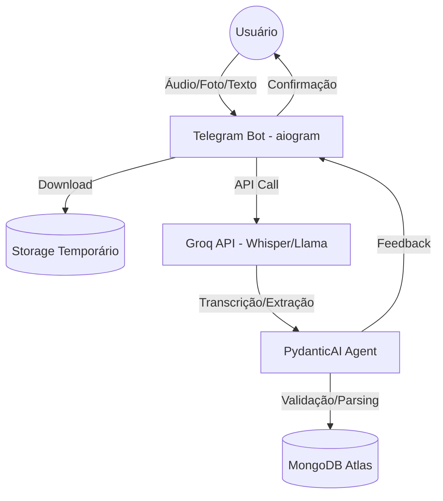
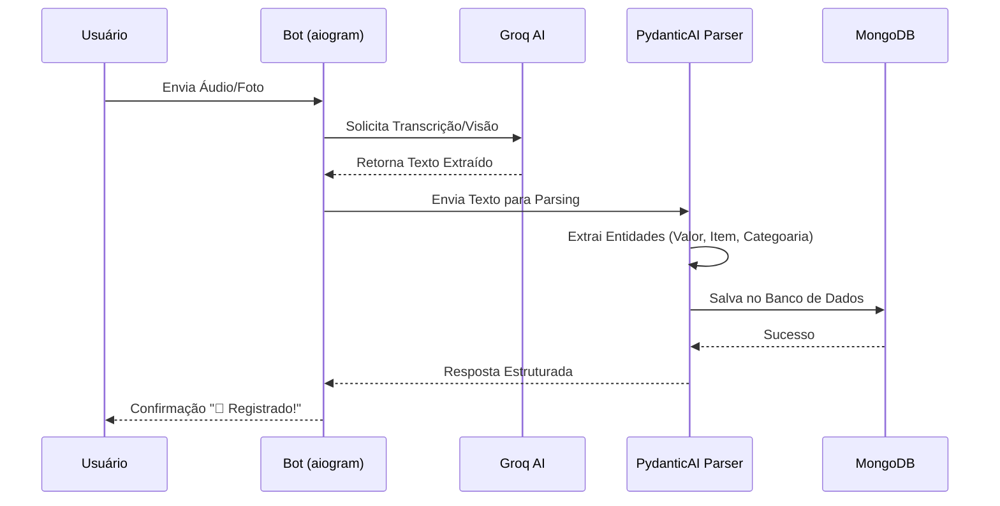

# Arquitetura do Eu Claw

O Eu Claw foi projetado para ser modular, extensível e ter custo zero de operação.

## 🧱 Componentes Principais

### 1. Comunicação (aiogram)
O bot utiliza a biblioteca `aiogram 3.x` para interações assíncronas no Telegram. Ele rastreia mensagens de voz, fotos e texto simples.

### 2. Orquestração de IA (PydanticAI)
Diferente dos prompts de texto tradicionais, utilizamos o **PydanticAI** para garantir que a extração de dados seja tipada e validada.
- **Modelos**: Primariamente Llama-3.1-70b (Groq).
- **Extração**: Transforma linguagem natural em objetos `FinancialEntry`.

## 🔄 Fluxo de Dados (Multimodal)

